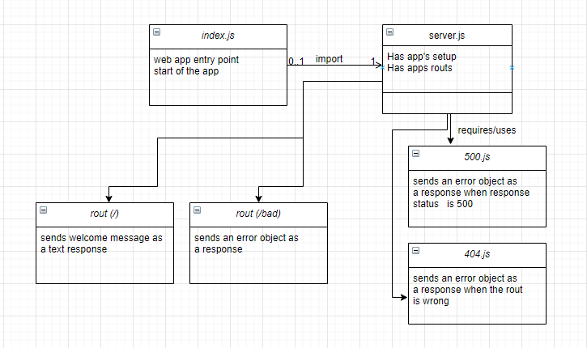

# server-deployment-practice


## About

* This project is to practice server deployment and code testing. t has 3 endpoints (/),(/bad,(*)) 

<hr>

## Author
Furat Malkawi

<hr>

## Links

* [Submission Pull Request]()

* [Deployed App](https://furat-api-server.herokuapp.com/)

* [Error Report]()

<hr>

## Setup

1. `(.env)` file 

```
PORT = 4000

```

2. Install the following dependencies

```
npm init -y 

npm i dotenv express

npm i -D jest supertest eslint


```

## Running the app 

1. clone the repo.

2. Enter the command `npm start`

3. Use endpoints :

   
  ### * (`/`)

<br>
  
- **Method** : GET 
- **Functionality** : Sends back a welcoming
  messege .
- **Response Body**   : TEXT
  
  
```
hello user
```

<br>

### * (`/bad`)
  
- **Method** : GET 
- **Functionality** : Throws and error, which invokes 500 error handler 
- **Response Body**   : JSON
  
  
```
    {
    status: 500,
    message: Internal Server Error,
    rout: /bad,
    }
```

<br>

### * not-existing endpoint
  
- **Method** : GET 
- **Functionality** : invokes 404 error handler 
- **Response Body**   : JSON
  
  
```
    {
    status: 404,
    message: 'page not found'
    }
```

<br>

4. Test . 

* There's 1 test file : server.test.js
   

* In terminal run :

```
npm test
```


<br><br><br>

<hr>

<br><br>


## UML Diagram

<br><br>





